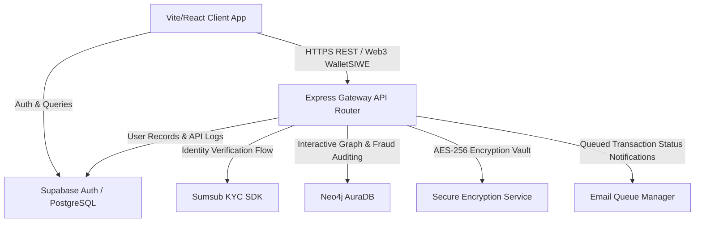

# Architecture & System Blueprint

Crifolayer is engineered as a decoupled, high-performance web application consisting of a modern single-page frontend (Vite/React 19) and a secure gateway backend API service (Node.js/Express.js 5).

---

## 🔄 Core Platform System Map

The system map highlights the network paths and data synchronization channels across client apps, gateways, storage engines, identity verification providers, and relationship graph DBs:



---

## 🛣️ Client-Side Route Matrix

Routing is configured in the React client application using `react-router-dom`:

| Client Route | Page Component | Access Control |
| :--- | :--- | :--- |
| `/` | `Landing` | Public |
| `/login` | `Login` | Public (with Cloudflare Turnstile bot gating) |
| `/pricing` | `Pricing` | Public |
| `/profile` | `PublicProfile` | Public (displays public identity badge summary) |
| `/logout` | `Logout` | Public |
| `/oauth/consent` | `OauthConsent` | Public (handles interactive user approvals for B2B OAuth) |
| `/dashboard` | `Dashboard` | Private layout (requires session login) |
| `/verification-center` | `VerificationCenter` | Private (Sumsub KYC Verification interface) |
| `/wallet` | `WalletDashboard` | Private (Ethereum/Decentralized credentials dashboard) |
| `/identity` | `Identity` | Private |
| `/passport` | `Passport` | Private (reputation card profile view) |
| `/connected-apps` | `ConnectedApps` | Private (lists connected B2C adapters) |
| `/analytics` | `RiskAnalysis` | Private (fraud audit and behavior metrics) |
| `/developer/portal` | `ApiDashboard` | Private Developer console |
| `/developer/keys` | `PersonalKeys` | Private Developer API key manager |
| `/developer/docs` | `DeveloperDocs` | Private interactive API references |
| `/developer/webhooks` | `DeveloperWebhooks` | Private webhooks dashboard |
| `/developer/playground` | `DeveloperPlayground` | Private API testing playground |
| `/developer/sdk` | `DeveloperSDK` | Private developer SDK guide |
| `/developer/status` | `DeveloperStatus` | Private API network status monitor |
| `/vault` | `ConsentVault` | Private GDPR & data sharing permission controls |
| `/admin` | `Admin` | Restricted (requires role === ADMIN status verification) |

---

## 📁 Codebase Directory Structure

```text
├── 📂 backend/                      # Backend gateway app code
│   ├── 📂 config/                   # Environmental configuration & Cloudinary integration
│   ├── 📂 controllers/              # REST request endpoint controllers
│   ├── 📂 db/                       # Supabase client wrapper & Neo4j driver
│   ├── 📂 docs/                     # API schema documentation (OpenAPI 3.0 yaml)
│   ├── 📂 middleware/               # Token authentications, rate limiting, and security
│   ├── 📂 models/                   # Schema validation models
│   ├── 📂 prisma/                   # PostgreSQL schema definition & migrations
│   ├── 📂 routes/                   # Router mount mappings
│   ├── 📂 services/                 # Graph query pipelines, encryption vault, email queues
│   ├── 📄 app.js                    # Core Express initialization entrypoint
│   └── 📄 package.json              # Backend service dependencies configuration
├── 📂 frontend/                     # Frontend client workspace
│   ├── 📂 src/
│   │   ├── 📂 components/           # UI widgets (DigiLocker, Graph test, Turnstile)
│   │   ├── 📂 context/              # Context files (Theme, Guest)
│   │   ├── 📂 hooks/                # SIWE and wallet connection hooks
│   │   ├── 📂 layouts/              # Side-navigation layout shells
│   │   ├── 📂 lib/                  # Web3 providers & Supabase connectors
│   │   └── 📂 pages/                # Page components
│   ├── 📄 package.json              # Frontend package dependencies configuration
│   └── 📄 vite.config.ts            # Frontend build configs
├── 📂 sdk/                          # Official B2B Developer Node.js SDK package
└── 📂 supabase/                     # Supabase database configurations & migration scripts
```
