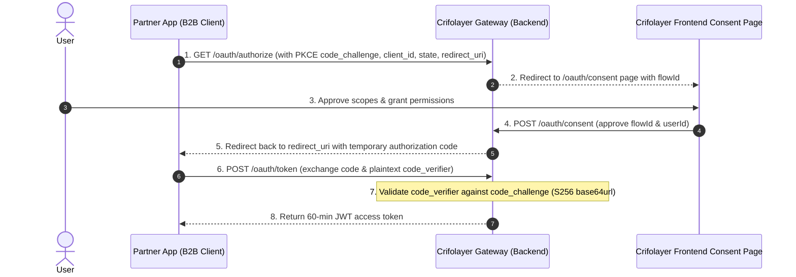

# B2B OAuth 2.0 PKCE Flow

Crifolayer implements a complete OAuth 2.0 PKCE (Proof Key for Code Exchange) authorization flow. This allows third-party B2B client applications to securely read verified user data without handling raw API credentials directly.

---

## 🔄 PKCE Authorization Sequence

The PKCE flow replaces client secrets with a dynamic cryptographic key pair generated by the client application on each request (the `code_verifier` and the SHA-256 hashed `code_challenge`).



---

## 🛠️ Step-by-Step Implementation Guide

### 1. Direct User to Authorization Endpoint
Construct the URL and redirect the user's browser. Make sure to generate a random cryptographically secure string for `code_verifier` and compute its base64url-encoded SHA-256 hash for the `code_challenge`:

```text
GET https://api.crifolayer.com/api/v1/oauth/authorize?
  response_type=code&
  client_id=YOUR_CLIENT_ID&
  redirect_uri=YOUR_REDIRECT_URI&
  scope=read:trustscore%20read:passport&
  state=RANDOM_STATE_STRING&
  code_challenge=BASE64URL_SHA256_VERIFIER&
  code_challenge_method=S256
```

### 2. Handle Consent and Authorization Code
If the user consents to the data scopes, the browser will redirect to your `redirect_uri` with a temporary `code` and your original `state`:

```text
GET https://partner.app/callback?
  code=tl_auth_code_9f8d7c6b5a4...&
  state=RANDOM_STATE_STRING
```

### 3. Exchange Code for Access Token
Perform a `POST` request from your server backend to swap the code for a JWT access token, sending the original unhashed `code_verifier` so the gateway can verify it:

```bash
curl -X POST https://api.crifolayer.com/api/v1/oauth/token \
  -H "Content-Type: application/json" \
  -d '{
    "grant_type": "authorization_code",
    "client_id": "YOUR_CLIENT_ID",
    "code": "tl_auth_code_9f8d7c6b5a4...",
    "redirect_uri": "YOUR_REDIRECT_URI",
    "code_verifier": "UNHASHED_PLAIN_TEXT_VERIFIER"
  }'
```

Response:
```json
{
  "token_type": "Bearer",
  "access_token": "eyJhbGciOiJIUzI1Ni...",
  "expires_in": 3600
}
```
